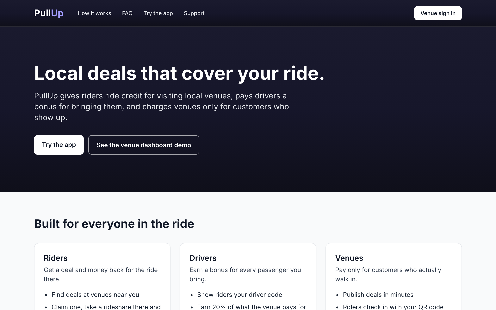
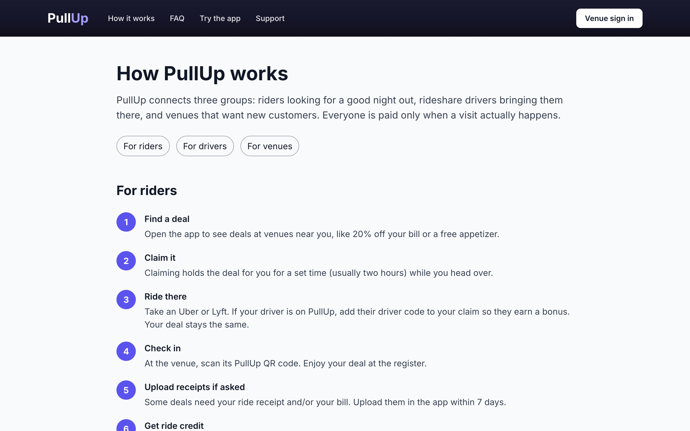
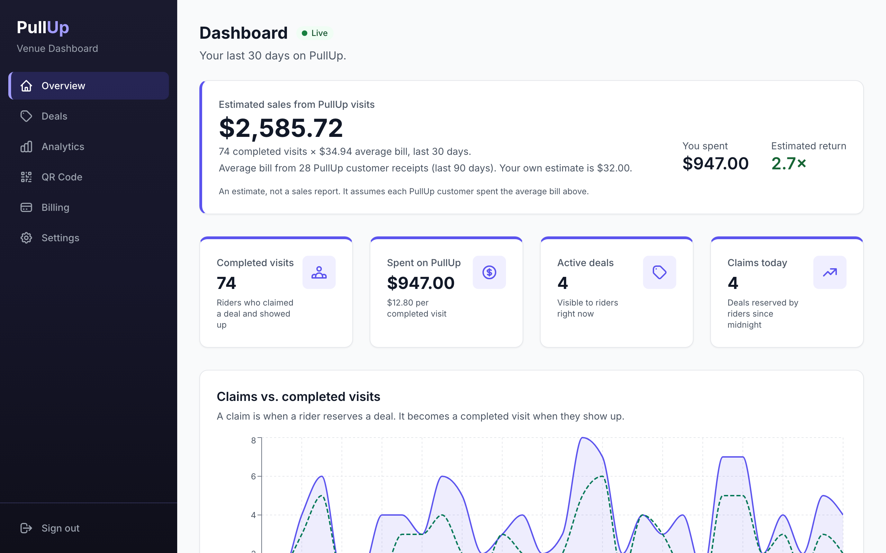
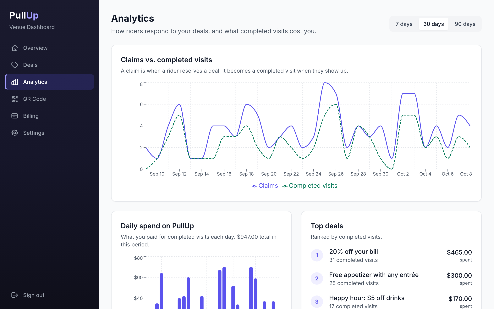
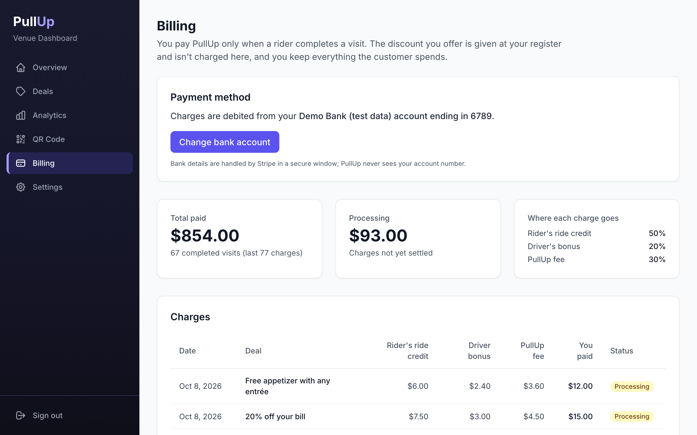

# PullUp

PullUp is a three-sided marketplace for local nightlife and dining. **Riders** claim deals at nearby venues and get ride credit for the trip there. **Rideshare drivers** earn a bonus when a rider they drove adds their driver code. **Venues** pay only for customers who actually show up and check in. This monorepo contains the rider/driver mobile app (Expo), the venue dashboard and marketing site (Next.js), and the Supabase backend (Postgres, row-level security, edge functions), with Stripe in test mode for bank linking and payouts.

**Live demo:** https://pullup-kappa-gray.vercel.app (demo only: Stripe test mode, sample data)
· [Try the app in your browser](https://pullup-kappa-gray.vercel.app/mobile)
· [Venue dashboard demo](https://pullup-kappa-gray.vercel.app/login)



## How it works

1. **Claim.** A rider finds a deal in the app (e.g. 20% off the bill) and claims it. The deal is held for them for a set time, usually two hours.
2. **Ride.** They take an Uber or Lyft there. If the driver is on PullUp, the rider adds the driver's code to the claim.
3. **Check in.** At the venue, the rider scans the venue's PullUp QR code, or types its 6-character check-in code. The discount is given at the register.
4. **Get paid.** If the deal requires proof, the rider uploads a ride receipt and/or the bill within 7 days, and PullUp staff review it. Once approved, the rider's ride credit and the driver's bonus are released, and both can cash out to a bank through Stripe.

Venues choose what a completed visit is worth to them (at least $10). PullUp splits it the same way every time:

| A $10 visit | Share | Amount |
| --- | --- | --- |
| Rider's ride credit | 50% | $5.00 |
| Driver's bonus | 20% | $2.00 |
| PullUp fee | 30% | $3.00 |

The split lives in one function, `calculateClaimCosts` in [`packages/shared/src/constants.ts`](packages/shared/src/constants.ts). It works in cents and gives the rounding remainder to the platform fee, so the three amounts always add up to exactly what the venue pays. A unit test checks every cost from $10.00 to $100.00.

## Screenshots

| How it works | Venue dashboard |
| --- | --- |
|  |  |
| **Analytics** | **Billing** |
|  |  |

## Demo logins

The demo accounts are one click away, so there's nothing to type:

- **Website** ([/login](https://pullup-kappa-gray.vercel.app/login)): "Fill in … login" buttons for a **venue owner**, **PullUp support staff** and a **PullUp admin**.
- **Mobile app** ([/mobile](https://pullup-kappa-gray.vercel.app/mobile)): "Demo rider" and "Demo driver" buttons on the sign-in screen.

The passwords aren't committed to this repo. They're set as deployment environment variables (`NEXT_PUBLIC_DEMO_*` on Vercel, `EXPO_PUBLIC_DEMO_*` on EAS) and shown on the sign-in pages. A database trigger ([`00041_lock_demo_account_credentials.sql`](supabase/migrations/00041_lock_demo_account_credentials.sql)) stops anyone from changing a demo account's password or email, so one visitor can't lock out the rest. Codes to try in the app: driver code `86YS23YR`, venue check-in code `CAFE42`.

## Architecture

```
pullup/
├── apps/
│   ├── mobile/          # Expo / React Native app for riders and drivers
│   └── web/             # Next.js 15: marketing site, venue dashboard, staff review tools
├── packages/
│   └── shared/          # Types, pricing split, code parsing, password rules (+ Vitest tests)
├── supabase/
│   ├── migrations/      # 41 SQL migrations: schema, RLS policies, RPCs, triggers, pg_cron jobs
│   ├── functions/       # 19 Deno edge functions (claims, check-in, receipts, Stripe, team)
│   └── tests/           # pgTAP access-control tests
├── e2e/                 # Playwright: role access, WCAG 2.2 AA checks, full functional flows
└── scripts/             # Demo data reset (seed-demo.mjs) and CI bootstrap
```

**Shared package.** `packages/shared` is an npm workspace package (`@pullup/shared`) that the web app, the mobile app and the demo seed script import directly from TypeScript source. It holds the database types (`DealClaim`, `DealWithVenue`, …), the cost split, QR and driver-code parsing, password rules and receipt-path helpers. The edge functions run on Deno and don't import it. They do their own validation on the server.

**Supabase.**
- **Auth:** email and password sign-up. A trigger creates the matching `public.users` row and a rider or driver profile. Sign-up can only create rider, driver or venue accounts (`safe_signup_role`); staff and admin roles are assigned server-side.
- **Postgres:** row-level security is enabled on all 11 app tables, with policies for each role. Roles are always read from `public.users`, never from client-editable JWT metadata. Two `pg_cron` jobs expire stale claims every minute and close visits once their 7-day receipt deadline has passed.
- **Edge functions:** anything that moves money or changes a claim's status, so the rules can't be bypassed from a client: `claim-deal` (riders only, daily cap, no duplicates), `link-driver`, `complete-claim`, `verify-receipt`, `cancel-claim`, payout setup and cash-out, team invites.
- **Storage:** a private `receipts` bucket that only the claim's rider and staff can read, and a public `venue-images` bucket. Both have size and file-type limits.

**Stripe (test mode).**
- **Venue bank linking:** `setup-venue-billing` creates a Stripe customer and SetupIntent. The dashboard collects the bank account with Stripe Financial Connections (`collectBankAccountForSetup`, then an ACH mandate), and `save-venue-payment-method` stores it. PullUp never sees the account number.
- **Rider and driver payouts:** `create-connect-account` and `create-driver-connect-account` create Stripe Connect Express accounts and onboarding links. `cashout` and `cashout-driver` send the available balance as a Stripe transfer.
- **Venue charges:** each completed visit writes `venue_charge`, `ride_reimbursement`, `platform_fee` and (if a driver was linked) `driver_kickback` rows to a `transactions` ledger. `process-payment` handles Stripe webhooks, plus admin-only actions that create the ACH PaymentIntent. Venues can retry a failed charge from Billing (`retry-venue-payment`). In this demo, venue charges aren't scheduled automatically.

**Check-in verification.** Each venue's QR code encodes `pullup://venue/<venue_id>/verify`. The app's scanner (`expo-camera`) reads it with the shared `parseQRContent` and calls `complete-claim`. That function only completes the rider's own reserved claim, only if the claim belongs to that venue and hasn't expired, and makes the status change with the service role, because a database trigger blocks riders from changing a claim's status directly. Riders who can't scan can type the venue's 6-character check-in code instead. It's looked up on the server and isn't readable from clients.

## Key engineering decisions

- **Authorization in the database, not just the UI.** RLS policies and `BEFORE UPDATE` triggers enforce what each role can see and change. Riders can only attach receipts to their own claims, and only after check-in. Venue owners can't touch billing fields or their check-in code. Support staff can review drivers, but only admins can suspend them. These rules are covered by 44 pgTAP assertions that run against a fresh database built from the migrations ([`supabase/tests`](supabase/tests/database/access_control.test.sql)).
- **Money moves only through edge functions.** Balance RPCs such as `increment_rider_balance` are revoked from `anon` and `authenticated` and granted only to the service role. Clients can't insert or complete claims directly. `claim-deal` and `complete-claim` do it after checking the rules.
- **A receipt approval flow that pays nothing until proof is in.** Deals can require a ride receipt and/or the venue bill. Riders upload them after check-in (private storage, photo types only). Staff approve or reject them in the web review queue, and approving a bill also records the real amount spent. Only when every required receipt is approved are the rider's credit and the driver's bonus released. A `pg_cron` job closes visits still missing receipts after 7 days, so the venue isn't charged and nobody is paid.
- **One pricing function, shared.** The 50/20/30 split is calculated in cents in `packages/shared`, so the web deal form, the marketing page and the seed data always agree, and the shares never drift a cent from what the venue pays.
- **Tests that exercise the real stack.** GitHub Actions runs unit tests (Vitest), the pgTAP database tests, and Playwright tests against a throwaway local Supabase with edge functions and Stripe test mode. The Playwright suite walks a full rider visit, staff receipt approval, venue deal management, admin actions and password reset by email. Another job runs access-control and axe WCAG 2.2 AA checks against production after every deploy ([`.github/workflows/tests.yml`](.github/workflows/tests.yml)).

## Tech stack

| Layer | Technology |
| --- | --- |
| Mobile app | Expo SDK 57 (React Native), Expo Router, Zustand, react-native-maps, expo-camera |
| Web | Next.js 15 (App Router), Tailwind CSS, Recharts, Stripe.js |
| Backend | Supabase: Postgres + RLS, Auth, Storage, Deno edge functions, pg_cron |
| Payments | Stripe test mode: Financial Connections / ACH, Connect Express |
| Monorepo | npm workspaces + Turborepo, TypeScript |
| Testing | Vitest, pgTAP, Playwright + axe-core, GitHub Actions |
| Hosting | Vercel (web), EAS Build and Update (mobile), Appetize (in-browser iOS demo) |

## Prerequisites

- Node.js 20+ and npm
- [Supabase CLI](https://supabase.com/docs/guides/cli) for migrations and edge functions (and Docker, to run Supabase locally)
- A Stripe account in test mode, for billing and payouts
- Expo: `npx expo` works without a global install

## Quick start

1. **Install dependencies**

   ```bash
   npm install
   ```

2. **Set up environment variables**

   ```bash
   cp apps/web/.env.example apps/web/.env.local
   cp apps/mobile/.env.example apps/mobile/.env
   ```

   See [Environment variables](#environment-variables) below.

3. **Set up the database:** see [Database setup](#database-setup).

4. **Run the web app** (marketing site, venue dashboard and staff tools)

   ```bash
   npm run dev:web
   ```

5. **Run the mobile app**

   ```bash
   npm run dev:mobile
   ```

## Environment variables

**Web** (`apps/web/.env.local`)

| Variable | Description |
| --- | --- |
| `NEXT_PUBLIC_SUPABASE_URL` | Supabase project URL |
| `NEXT_PUBLIC_SUPABASE_ANON_KEY` | Supabase anon (public) key |
| `SUPABASE_SERVICE_ROLE_KEY` | Service role key. Server only; also used by `scripts/seed-demo.mjs` |
| `NEXT_PUBLIC_STRIPE_PUBLISHABLE_KEY` | Stripe publishable key (`pk_test_…`) for bank linking |
| `NEXT_PUBLIC_DEMO_EMAIL`, `NEXT_PUBLIC_DEMO_PASSWORD` | Optional. Demo venue login shown on `/login` |
| `NEXT_PUBLIC_DEMO_STAFF_*`, `NEXT_PUBLIC_DEMO_ADMIN_*` | Optional. Demo staff and admin logins (`_EMAIL`, `_PASSWORD`) |
| `NEXT_PUBLIC_DEMO_RIDER_*`, `NEXT_PUBLIC_DEMO_DRIVER_*`, `NEXT_PUBLIC_DEMO_DRIVER_CODE`, `NEXT_PUBLIC_DEMO_CHECKIN_CODE` | Optional. Shown on the `/mobile` "Try the app" page |
| `NEXT_PUBLIC_APPETIZE_URL`, `NEXT_PUBLIC_ANDROID_APK_URL`, `NEXT_PUBLIC_EXPO_GO_URL`, `NEXT_PUBLIC_EXPO_GO_PUBLIC`, `NEXT_PUBLIC_DEMO_VIDEO_URL` | Optional. Links on the `/mobile` page |

**Mobile** (`apps/mobile/.env`, or EAS environment variables)

| Variable | Description |
| --- | --- |
| `EXPO_PUBLIC_SUPABASE_URL`, `EXPO_PUBLIC_SUPABASE_ANON_KEY` | Supabase project URL and anon key |
| `EXPO_PUBLIC_SITE_URL` | Website base URL for the Help, FAQ and support links |
| `EXPO_PUBLIC_SUPPORT_EMAIL` | Optional. Support email for drivers under review |
| `EXPO_PUBLIC_DEMO_VENUE_ID` | Optional. Venue shown when no venues are nearby |
| `EXPO_PUBLIC_DEMO_RIDER_*`, `EXPO_PUBLIC_DEMO_DRIVER_*` | Optional. One-tap demo logins (`_EMAIL`, `_PASSWORD`) |

**Edge function secrets** (`supabase secrets set …`; `SUPABASE_URL`, `SUPABASE_ANON_KEY` and `SUPABASE_SERVICE_ROLE_KEY` are provided automatically)

| Secret | Description |
| --- | --- |
| `STRIPE_SECRET_KEY` | Stripe secret key (`sk_test_…`) |
| `STRIPE_WEBHOOK_SECRET`, `STRIPE_WEBHOOK_SECRET_RIDER`, `STRIPE_WEBHOOK_SECRET_DRIVER` | Webhook signing secrets |
| `CRON_SECRET` | Shared secret for the `expire-claims` function |
| `NEXT_PUBLIC_APP_URL` | Website URL linked from payment-failure emails |
| `RESEND_API_KEY`, `RESEND_FROM_EMAIL` | Optional. Payment-failure emails to venues |
| `DEMO_MODE` | `true` turns off team invites and protects the demo accounts from removal |

## Database setup

1. Create a project on [Supabase](https://supabase.com) and put its URL and keys in your env files.
2. Link the project and apply the migrations:

   ```bash
   supabase link --project-ref <your-project-ref>
   ```

   ```bash
   supabase db push
   ```

3. Deploy the edge functions and set their secrets (see above):

   ```bash
   supabase functions deploy
   ```

4. Optional: load the demo venue's sample data. Sign up the demo venue owner first, then run:

   ```bash
   node --env-file=apps/web/.env.local scripts/seed-demo.mjs
   ```

## Available scripts

| Script | Description |
| --- | --- |
| `npm run dev:web` | Start the Next.js web app in dev mode |
| `npm run dev:mobile` | Start the Expo app in dev mode |
| `npm run build:web` | Production build of the web app |
| `npm run typecheck` | TypeScript type checking across packages |
| `npm run lint` | Lint across packages |
| `npm test` | Unit tests (Vitest, `packages/shared`) |
| `npm run test:e2e` | Playwright tests; read-only tests run against production by default (`E2E_BASE_URL` to change) |
| `supabase test db` | pgTAP database tests (needs a local Supabase) |

## Built with AI assistance

I designed the product (the marketplace model, user flows, pricing and access rules). [Claude Code](https://claude.com/claude-code) proposed the tech stack and wrote the implementation, which I directed, tested and reviewed.
